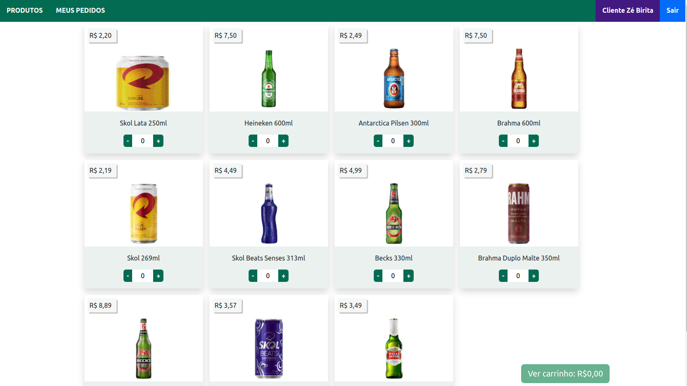

<h1>Async Beer Delivery</h1>
<hr>

<h2>Projeto FullStack realizado em equipe no Módulo de Back-end na <a href='betrybe.com'>Trybe</a>.</h2>

<h2>Prévia</h2>


<hr>

<h1>Descrição</h1>
<h3>O Objetivo era criar um Delivery App de Bebidas, que o cliente pudesse fazer o pedido da sua bebida favorita em casa, a aplicação contém uma verificação para ver se o usuario e Administrador, Vendedor ou Cliente.</h3>

<hr>

<h1>tecnologias utilizadas</h1>

<ul>
  <li>JavaScript</li>
  <li>React.js</li>
  <li>Bootstrap</li>
  <li>Express.Js</li>
  <li>MySql</li>
  <li>Node.js</li>
  <li>JWT(Autenticação)</li>
</ul>
<hr>

<h1>Como executar o projeto na sua máquina</h1>

strong>1. Fazer o git clone na sua máquina e entrar no diretório:</strong>
 - Lembre-se de clonar o repositório no diretório desejado na sua máquina!
 ```
 git clone git@github.com:oGabrielDev/Delivery-App.git
 cd Delivery-App
 ```
 
 <strong>2. Instale as dependências</strong>

  - Para isso, use o seguinte comando na pasta raiz:
  > PS - a versão do Node utilizada neste projeto foi a 16.0.0
  ```
  npm install
  ```
  
 <strong>3. Inicie a API e Front-End</strong>
 
  - Para isso, na pasta raiz execute o comando:
  

  ```
  npm start
  ```  
  > PS - a API irá rodar na porta 3001, então certifique-se que a mesma não está sendo usada, a aplicação sera iniciada em segundo plano por conta do pm2


 ## Como usar a aplicação
  <strong>Cliente</strong>
  - Para acessar a aplicação como cliente, utilize as credenciais abaixo:
  ```
  email: zebirita@email.com
  senha: '$#zebirita#$'
  ```
  
  <strong>Vendedor</strong>
  - Para acessar a aplicação como vendedor, utilize as credenciais abaixo:
  ```
  email: fulana@deliveryapp.com
  senha: fulana@123
  ```

  <strong>Administrador</strong>
  - Para acessar a aplicação como administrador, utilize as credenciais abaixo:
  ```
  email: adm@deliveryapp.com
  senha: --adm2@21!!--
  ```
  
  ## :clap: Agradecimentos aos membros da equipe:
  
  - [Adriano Costa](https://github.com/adfcosta)
  - [Daniel Yabu](https://github.com/d4n13ln13ls3n)
  - [Fábio Barbirato](https://github.com/FabioBarbirato)
  - [Tayná Macedo](https://github.com/Tayna-Silva-Macedo)